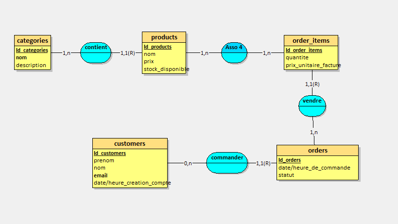
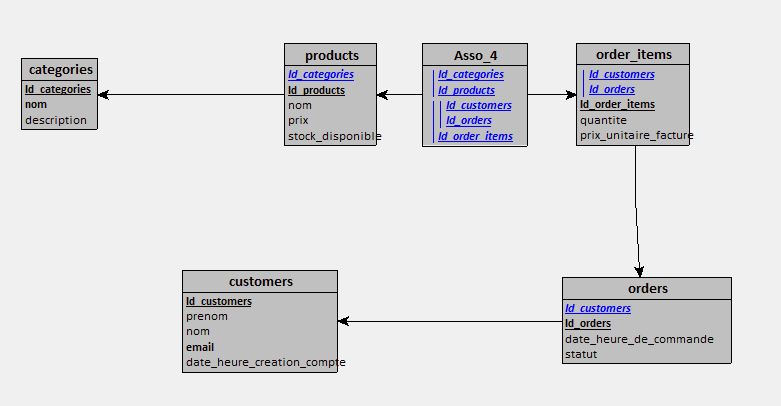

# Projet E-Commerce — PostgreSQL + Docker + Génération de Rapport Python

## Description

Ce projet propose un environnement complet pour :
- Créer et initialiser une base de données **PostgreSQL** avec des scripts SQL.
- Gérer facilement la bdd via **pgAdmin**.
- Exécuter un script **Python Dockerisé** générant un **rapport d'analyse** à partir des données.
- Produire automatiquement un fichier texte `analyses.txt`.
- Le tout **Dockerisé** pour permettre d'executer le projet dans un environnement maitrisé.

## Documentations 




## Structure du Projet

```
e_commerce
├─ app
│  ├─ doc
│  │  ├─ e_commerce.loo
│  │  ├─ MCD.png
│  │  ├─ MLD.png
│  │  └─ tp_ecomerce.md
│  ├─ Dockerfile
│  ├─ main.py
│  └─ requests.py
├─ docker-compose.yml
├─ init.sql
├─ rapport_supershop.txt
└─ README.md

```

## Technologies Utilisées

- **Docker & Docker Compose**
- **PostgreSQL**
- **pgAdmin**
- **Python, psycopg**


## Installation & Lancement

Assurez-vous d’avoir **Docker** d'installé.

 - Renommer le fichier .env_exemple.txt --> .env, ajuster les variables si necessaire

 - Executer le projet
   ```bash
        docker compose up -d
    ```
    Cela va :

    * Créer les conteneurs,
    * Exécuter automatiquement le script SQL init.sql
    * Démarrer pgAdmin sur `http://localhost:8080`.

 🔴 Les scripts python interroge la bdd sous `localhost` pour le moment (il faut donc utiliser les scripts en local, en dehors de docker)


### Identifiants par defaut :

- PgAdmin 

    * **Email** : `admin@admin.com`
    * **Mot de passe** : `admin`

- La base PostgreSQL :

    * **hôte Docker** : `db`
    * **port** : `5432`
    * **utilisateur** : `admin`
    * **mot de passe** : `admin`
    * **base** : `supershop`

---


## Réinitialiser complètement l’environnement

Pour effacer la base PostgreSQL, pgAdmin et les volumes :

```bash
docker compose down -v
```

Puis relancer :

```bash
docker compose up -d
```

